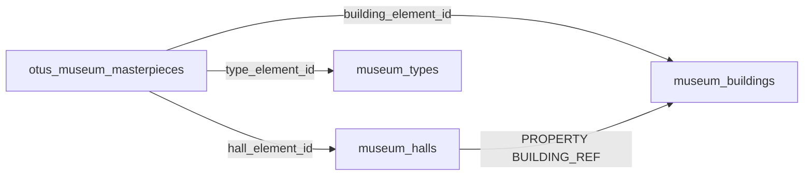
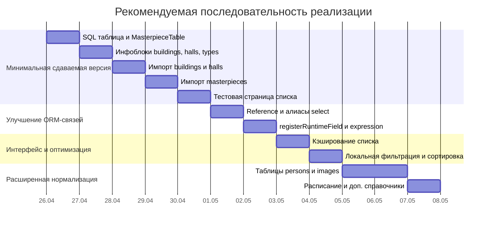

# Архитектура учебного проекта Bitrix D7 ORM для музейных JSON-данных

## Executive summary

Для этого ДЗ я рекомендую **не пытаться нормализовать весь музейный каталог сразу**, а сделать **главной сущностью собственную SQL-таблицу экспонатов** и связать её с **двумя или тремя инфоблоками**. Практически лучший вариант для сдачи — таблица `otus_museum_masterpieces` плюс инфоблоки `museum_buildings`, `museum_halls` и, как аккуратный третий справочник, `museum_types`. Это напрямую закрывает требования задания: своя таблица, ORM-модель, числовые/строковые/связываемые поля, минимум два инфоблока, выборка из SQL вместе со свойствами элементов инфоблоков, а также понятное место для `Reference`, `Join::on()` и `registerRuntimeField()`. Требования самого ДЗ и ограничения по данным явно тянут именно к такой архитектуре. fileciteturn3file14 fileciteturn3file11 citeturn4view0turn2view0turn2view2turn8view0

По содержимому файлов картина очень показательная: в `masterpieces.json` — **97 записей экспонатов**, в `buildings.json` — **11 записей зданий**; из них у **4 зданий** есть вложенные этажи и залы, всего **11 этажей** и **61 зал**. В самих экспонатах у **70** записей есть ссылка на здание, у **31** — непустая ссылка на зал. При этом все непустые `building` и `hall` из экспонатов разрешаются в `buildings.json`, то есть связь между файлами хорошая, но поля связей должны быть **nullable**, потому что часть записей зал не содержит вовсе. Также важно, что поле `year` бывает отрицательным, поэтому его нельзя делать `UNSIGNED`: нужен **signed INT**. Эти наблюдения получаются при просмотре файлов целиком, а не только первых объектов. fileciteturn2file1 fileciteturn2file2

Главные кандидаты на **второй этап**, а не на первую сдаваемую версию, — это `authors`, `collectors`, `gallery`, `schedule`, `origplace`, `shop` и часть текстовых HTML-полей. Причина простая: эти данные либо неоднородны по типам, либо слишком богаты и вложены, либо редко заполнены. Для учебной сдачи лучше показать чистую и понятную модель, чем утонуть в переусложнении. fileciteturn3file0 fileciteturn3file1 fileciteturn3file8

## Карта данных

Исходные JSON очень похожи на витринные данные каталога entity["point_of_interest","ГМИИ им. А. С. Пушкина","Moscow, Russia"] и хорошо подходят для учебного проекта на платформе entity["company","1C-Битрикс","software vendor"]: один файл описывает экспонаты, второй — здания, этажи, залы и связанные с ними контентные блоки. Важное ограничение из постановки: использовать нужно только `ru`, `en` можно игнорировать. fileciteturn3file14

### Что находится в `masterpieces.json`

Это каталог музейных предметов, где **один JSON-объект = один экспонат**. На верхнем уровне у записей встречается **42 поля**. Почти у всех объектов есть стабильное ядро: `path`, `m_parent_id`, `year`, `get_year`, `inv_num`, `type`, `country`, `period`, `masterpiece`, `show_in_hall`, `show_in_collection`, `name`, `gallery`, `cast`. Именно эти поля разумно считать базой для главной таблицы. fileciteturn2file2

По типам данных файл неоднороден, но закономерен:

| Группа | Примеры | Практический вывод |
|---|---|---|
| Строковые скаляры | `path`, `m_parent_id`, `inv_num`, `department`, `building`, `hall` | годятся для SQL-колонок или для source-map |
| Числовые | `year`, `show_in_collection` | `year` должен быть signed |
| Булевы по смыслу, но не по типу | `masterpiece`, `show_in_hall`, `cast` | при импорте нормализовать в `TINYINT(1)` |
| Локализованные объекты `ru/en` | `type`, `country`, `name`, `size`, `text`, `annotation`, `material` | для первой версии брать только `ru` |
| Вложенные объекты | `period.name`, `period.text`, `gallery`, `authors`, `collectors`, `origplace` | кандидаты на отдельные сущности или отложенный этап |

Эта типология подтверждается примерами из файла: у экспоната может быть `building = "116"` и `hall = "191"`, `gallery` с вложенными `id01/id02/id03`, пустая строка в `authors`, либо объект `authors.1.ru`, а у слепков дополнительно появляется `origplace`. fileciteturn2file2 fileciteturn3file5 fileciteturn3file7 fileciteturn3file8

Статистически полезно разделить поля так. **Почти всегда заполнены**: `name`, `inv_num`, `year`, `type`, `country`, `period`, `gallery`. **Часто заполнены, но не всегда**: `authors` (74 из 97), `building` (70 из 97), `size` (90 из 97), `searcha` (58 из 97), `material` (55 из 97), `paint_school` (51 из 97), `text` (49 из 97). **Редкие**: `collectors` (19), `from` (15), `namecom` (9), `graphics_type` (8), `link` и `linktext` (по 4), `origplace` и `shop` (по 2). **Полностью пустые в этом наборе**: `audioguide`, `videoguide`, `litra`, `restor`, `producein`, `matvos`, `sizevos`, `prodcast`, `makers`. Для первой версии это сильный аргумент не тащить их в схему. fileciteturn2file2

Самые важные “грязные” поля такие: `authors` бывает и пустой строкой, и объектом; `collectors` — так же; `get_year` бывает и числом, и строкой; `show_in_hall` бывает и `0/1` как `int`, и `"0"/"1"` как `string`; `paint_school` и `graphics_type` иногда объект, иногда пустая строка; `shop` почти всегда пустая строка, но местами словарь идентификаторов. Это значит, что на импорте нужен **нормализующий слой**, а не прямое `json_decode()` → `add()`. fileciteturn2file2 fileciteturn3file6

### Что находится в `buildings.json`

Это не просто справочник зданий, а довольно богатый контентный файл о музейных пространствах. На верхнем уровне у записей встречается **30 полей**: от `name`, `menu`, `brief`, `text`, `adress`, `picture` и `yamapcoords` до `schedule`, `floors`, `virtual_tour`, `audiog`, `rules` и `ticket`. Здесь явно много данных, которые естественно живут как контент, а не как голые справочники. fileciteturn2file1

Особенно важны три вложенные структуры:

- `schedule` — объект `regulars` + `exceptions`, но само поле бывает и объектом, и пустой строкой; внутри `exceptions` значение бывает либо `"closed"`, либо объектом `{timebegin, timeend}`. fileciteturn3file1 fileciteturn3file2
- `floors` — либо пустая строка, либо словарь этажей; этаж содержит `number`, `name`, `plan`, `halls`. fileciteturn3file0 fileciteturn3file3
- `halls` — внутри этажа; зал содержит `number`, `img`, `img_header`, `virtual_tour`, `exposition`, `satellites`, `name`, `short`, `text`, `searcha`, `seakeys`. fileciteturn3file0 fileciteturn3file3

Для учебной архитектуры это очень хороший кандидат на **инфоблоки**, потому что здание и зал — это редакторский контент с текстами, картинками, виртуальными турами и навигационными свойствами, а не только системные справочники. При этом поле `floors` заполнено лишь у части зданий, значит этаж в минимальной версии стоит делать **свойством зала**, а не отдельной сущностью. fileciteturn2file1 fileciteturn3file0

### Какие сущности выделяются и какие связи есть

Из двух файлов естественно выделяются такие сущности:

- **Masterpiece** — экспонат, главная сущность проекта.
- **Building** — здание музея.
- **Hall** — зал.
- **Floor** — этаж.
- **Type** — тип экспоната.
- **Person** — автор или коллекционер.
- **Image** — изображение экспоната.
- **Schedule item** — правило расписания по зданию.
- **Period / Country / Paint school** — справочники, но не обязательные на первом этапе.

Связи при этом читаются очень ясно: `masterpiece.building -> buildings[id]`, `masterpiece.hall -> halls[id]`, а зал сам принадлежит зданию через вложенность файла `buildings.json`. Кроме того, один экспонат может иметь несколько авторов и несколько изображений; это уже не минимальная, а расширенная модель. fileciteturn2file1 fileciteturn2file2

## Рекомендуемая модель хранения

Ниже — схема, которая одновременно отвечает структуре данных и требованиям ДЗ. Таблица построена по полному анализу обоих JSON и по ограничениям задания. fileciteturn3file14 fileciteturn2file1 fileciteturn2file2

| Сущность | Источник в JSON | Тип хранения | Назначение | Почему так |
|---|---|---|---|---|
| Экспонат | `masterpieces.json` | SQL-таблица | Главная сущность проекта | Это и есть “своя таблица БД”, вокруг которой строится ДЗ |
| Здание | `buildings.json` | инфоблок | Контент по зданию, адрес, тексты, картинки, расписание-сводка | Хорошо редактируется в админке, удобно тянуть свойства в списке |
| Зал | `buildings.json -> floors -> halls` | инфоблок | Название зала, номер, этаж, привязка к зданию | Это второй обязательный инфоблок и естественный справочник |
| Тип экспоната | `masterpieces.json -> type.ru` | инфоблок | Третий, аккуратный справочник | Мало значений, одно значение на экспонат, хорошо закрывает “2–3 инфоблока” |
| Этаж | `buildings.json -> floors` | свойство инфоблока зала | Для первой версии достаточно `FLOOR_NUMBER`, `FLOOR_SOURCE_ID` | Отдельная сущность здесь пока тяжеловата |
| Страна | `masterpieces.json -> country.ru` | поле SQL или отложенный справочник | Для вывода в списке | Справочник страны можно сделать позже |
| Период | `masterpieces.json -> period.*` | поле SQL | Человеко-читаемый период | Значения уже строковые и нередко “грязные” для строгой нормализации |
| Автор / коллекционер | `authors`, `collectors` | отложить на второй этап / связующая таблица | Для ManyToMany и ролей | Поле неоднородно, есть множественность и роль |
| Изображения | `gallery` | в минимуме — поле SQL `first_image_path`; в расширении — отдельная SQL-таблица | Для списка и галереи | В минимуме надо только первое изображение |
| Расписание | `schedule` | отложить на второй этап / SQL-таблицы | Для продвинутого интерфейса | Слишком сложная вложенная структура для первой сдачи |
| `origplace`, `shop`, `department`, `link*` | редкие поля | отложить на второй этап | Дополнительные функции | Редко заполнены или семантически неочевидны |

**Главная таблица**: `otus_museum_masterpieces`.  
**Лучшие инфоблоки для первой версии**: `museum_buildings`, `museum_halls`, `museum_types`.  
**Лучшие отдельные SQL-таблицы на втором этапе**: `museum_masterpiece_details`, `museum_masterpiece_images`, `museum_persons`, `museum_masterpiece_persons`, `museum_building_schedule_regular`, `museum_building_schedule_exceptions`. fileciteturn3file11 fileciteturn3file12



Эта минимальная схема хорошо совпадает с тем, как D7 ORM работает с собственными таблицами и с ORM-интеграцией инфоблоков: собственная таблица описывается через `DataManager` с `getTableName()` и `getMap()`, связи — через `Reference` и `Join::on()`, а каждый инфоблок при наличии `API_CODE` становится собственной ORM-сущностью. citeturn4view0turn2view0turn8view0turn8view1

## Вариант A для сдачи ДЗ

### Почему этот вариант подходит лучше всего

Это самый чистый и защищаемый вариант на сдаче. Он не спорит с формулировкой задания, а буквально её реализует: есть одна собственная SQL-таблица, есть 2–3 инфоблока, есть связи по ID, есть вывод списка, есть подтягивание свойств инфоблоков, и есть место показать `Reference` и `registerRuntimeField()`. Если вы принесёте слишком нормализованную схему сразу, преподаватель очень легко спросит: “А где здесь ваш **минимальный** учебный кейс с одной своей таблицей, привязанной к двум инфоблокам?” Здесь такого риска нет. fileciteturn3file14 fileciteturn3file11

### Минимальная схема для ДЗ

Рекомендую такую таблицу:

**Таблица:** `otus_museum_masterpieces`

Ниже — поля, которые действительно нужны для учебной версии. Они закрывают числовой, строковый и связываемый типы, а также список вывода. Поля ссылаются на элементы инфоблоков не по source-id, а по **реальному ID элемента инфоблока**, а source-id сохраняются отдельно для повторного импорта. Такая схема следует и данным файлов, и учебной задаче. fileciteturn3file12 fileciteturn2file2

| Поле | SQL тип | Источник | Зачем |
|---|---|---|---|
| `ID` | `INT UNSIGNED AI PK` | системное | первичный ключ |
| `SOURCE_ID` | `INT UNSIGNED NOT NULL UNIQUE` | ключ объекта в `masterpieces.json` | защита от дублей при повторном импорте |
| `NAME_RU` | `VARCHAR(255) NOT NULL` | `name.ru` | название экспоната |
| `INV_NUM` | `VARCHAR(100) NOT NULL` | `inv_num` | инвентарный номер |
| `YEAR_VALUE` | `INT NOT NULL` | `year` | год, signed из-за значений до н.э. |
| `GET_YEAR` | `SMALLINT UNSIGNED NULL` | `get_year` | год поступления / получения |
| `COUNTRY_RU` | `VARCHAR(100) NULL` | `country.ru` | страна для списка |
| `PERIOD_NAME_RU` | `VARCHAR(150) NULL` | `period.name.ru` | период для краткого вывода |
| `BUILDING_SOURCE_ID` | `INT UNSIGNED NULL` | `building` | исходная ссылка из JSON |
| `HALL_SOURCE_ID` | `INT UNSIGNED NULL` | `hall` | исходная ссылка из JSON |
| `BUILDING_ELEMENT_ID` | `INT UNSIGNED NULL` | после импорта инфоблоков | связь с `museum_buildings` |
| `HALL_ELEMENT_ID` | `INT UNSIGNED NULL` | после импорта инфоблоков | связь с `museum_halls` |
| `TYPE_ELEMENT_ID` | `INT UNSIGNED NULL` | после импорта типов | связь с `museum_types` |
| `FIRST_IMAGE_PATH` | `VARCHAR(500) NULL` | первый путь из `gallery` | картинка в списке |
| `DETAIL_PATH` | `VARCHAR(500) NOT NULL` | `path` | отладка, аудит, возможная ссылка |
| `SHOW_IN_HALL` | `TINYINT(1) NOT NULL DEFAULT 0` | `show_in_hall` | булево-подобный флаг |
| `SHOW_IN_COLLECTION` | `TINYINT(1) NOT NULL DEFAULT 1` | `show_in_collection` | булево-подобный флаг |
| `IS_CAST` | `TINYINT(1) NOT NULL DEFAULT 0` | `cast` | булево-подобный флаг |
| `CREATED_AT` | `DATETIME NOT NULL` | системное | аудит |
| `UPDATED_AT` | `DATETIME NOT NULL` | системное | аудит |

**Где тут типы из ДЗ:**

- **числовые поля**: `YEAR_VALUE`, `GET_YEAR`, флаги `SHOW_IN_HALL`, `SHOW_IN_COLLECTION`, `IS_CAST`;
- **строковые поля**: `NAME_RU`, `INV_NUM`, `COUNTRY_RU`, `DETAIL_PATH`;
- **связываемые поля**: `BUILDING_ELEMENT_ID`, `HALL_ELEMENT_ID`, `TYPE_ELEMENT_ID`.

### Какие инфоблоки создать

Для первой версии я советую именно эти три:

| Инфоблок | API_CODE | Назначение | Что хранить |
|---|---|---|---|
| Здания | `museum_buildings` | музейные здания | `NAME`, `DETAIL_TEXT`, `SOURCE_ID`, `ADDRESS_RU`, `MAP_COORDS`, `CLOSED_FLAG`, `TICKET_URL`, `PICTURE_PATH`, `TIMELINE_RU` |
| Залы | `museum_halls` | залы музея | `NAME`, `DETAIL_TEXT`, `SOURCE_ID`, `BUILDING_REF`, `BUILDING_SOURCE_ID`, `FLOOR_SOURCE_ID`, `FLOOR_NUMBER`, `HALL_NUMBER`, `PLAN_PATH`, `IMAGE_PATH`, `VIRTUAL_TOUR_URL` |
| Типы | `museum_types` | типы экспонатов | `NAME`, `TYPE_CODE` |

Практическая деталь: у инфоблоков обязательно задайте **`API_CODE`**, иначе удобной ORM-интеграции не будет. У `museum_halls` обязательно сделайте свойство-привязку `BUILDING_REF` к элементу инфоблока `museum_buildings`. Официальная документация прямо говорит, что ORM-интеграция инфоблоков строится вокруг `API_CODE`, где один инфоблок становится отдельной ORM-сущностью, а свойства становятся отношениями. citeturn8view0turn8view1

### SQL DDL

```sql
CREATE TABLE `otus_museum_masterpieces` (
  `ID` INT UNSIGNED NOT NULL AUTO_INCREMENT,
  `SOURCE_ID` INT UNSIGNED NOT NULL,
  `NAME_RU` VARCHAR(255) NOT NULL,
  `INV_NUM` VARCHAR(100) NOT NULL,
  `YEAR_VALUE` INT NOT NULL,
  `GET_YEAR` SMALLINT UNSIGNED NULL,
  `COUNTRY_RU` VARCHAR(100) NULL,
  `PERIOD_NAME_RU` VARCHAR(150) NULL,
  `BUILDING_SOURCE_ID` INT UNSIGNED NULL,
  `HALL_SOURCE_ID` INT UNSIGNED NULL,
  `BUILDING_ELEMENT_ID` INT UNSIGNED NULL,
  `HALL_ELEMENT_ID` INT UNSIGNED NULL,
  `TYPE_ELEMENT_ID` INT UNSIGNED NULL,
  `FIRST_IMAGE_PATH` VARCHAR(500) NULL,
  `DETAIL_PATH` VARCHAR(500) NOT NULL,
  `SHOW_IN_HALL` TINYINT(1) NOT NULL DEFAULT 0,
  `SHOW_IN_COLLECTION` TINYINT(1) NOT NULL DEFAULT 1,
  `IS_CAST` TINYINT(1) NOT NULL DEFAULT 0,
  `CREATED_AT` DATETIME NOT NULL DEFAULT CURRENT_TIMESTAMP,
  `UPDATED_AT` DATETIME NOT NULL DEFAULT CURRENT_TIMESTAMP ON UPDATE CURRENT_TIMESTAMP,
  PRIMARY KEY (`ID`),
  UNIQUE KEY `ux_otus_museum_masterpieces_source_id` (`SOURCE_ID`),
  KEY `idx_otus_mm_year` (`YEAR_VALUE`),
  KEY `idx_otus_mm_inv_num` (`INV_NUM`),
  KEY `idx_otus_mm_building_el` (`BUILDING_ELEMENT_ID`),
  KEY `idx_otus_mm_hall_el` (`HALL_ELEMENT_ID`),
  KEY `idx_otus_mm_type_el` (`TYPE_ELEMENT_ID`),
  KEY `idx_otus_mm_building_hall` (`BUILDING_ELEMENT_ID`, `HALL_ELEMENT_ID`),
  KEY `idx_otus_mm_flags` (`SHOW_IN_COLLECTION`, `SHOW_IN_HALL`, `IS_CAST`)
) ENGINE=InnoDB
  DEFAULT CHARSET=utf8mb4
  COLLATE=utf8mb4_unicode_ci;
```

Если на стенде ядро Bitrix хранит `b_iblock_element` в `InnoDB` и вы хотите именно жёсткие внешние ключи, их можно добавить отдельным `ALTER TABLE`. Но для учебного проекта в Bitrix обычно достаточно **индексированных логических ссылок** и проверки существования элементов на импорте: это проще и стабильнее для коробочных инсталляций. citeturn4view0

### ORM-модели Bitrix D7

С точки зрения D7 ваша custom ORM-сущность должна наследоваться от `DataManager` и переопределять `getTableName()` и `getMap()`. Это базовое требование официальной документации. citeturn4view0

| Путь | Namespace | Класс | Что описывает | Ключевые поля `getMap()` | Связи |
|---|---|---|---|---|---|
| `/local/modules/otus.museum/lib/model/masterpiece.php` | `Otus\Museum\Model` | `MasterpieceTable` | `otus_museum_masterpieces` | все поля таблицы выше | `Reference` на `BUILDING_ITEM`, `HALL_ITEM`, `TYPE_ITEM` через `Join::on()` |
| системный класс, генерируется ядром | `Bitrix\Iblock\Elements` | `ElementMuseumBuildingsTable` | инфоблок `museum_buildings` | поля элемента + свойства инфоблока | используется как target в `Reference` |
| системный класс, генерируется ядром | `Bitrix\Iblock\Elements` | `ElementMuseumHallsTable` | инфоблок `museum_halls` | поля элемента + свойства инфоблока | у зала есть свойство `BUILDING_REF` |
| системный класс, генерируется ядром | `Bitrix\Iblock\Elements` | `ElementMuseumTypesTable` | инфоблок `museum_types` | поля элемента + свойства инфоблока | используется как target в `Reference` |

Пример логики связей в `MasterpieceTable` такой:

- `BUILDING_ITEM` → `ElementMuseumBuildingsTable::class` по `this.BUILDING_ELEMENT_ID = ref.ID`;
- `HALL_ITEM` → `ElementMuseumHallsTable::class` по `this.HALL_ELEMENT_ID = ref.ID`;
- `TYPE_ITEM` → `ElementMuseumTypesTable::class` по `this.TYPE_ELEMENT_ID = ref.ID`.

Именно так в D7 правильно описываются направленные связи “многие-к-одному”; на обратной стороне при необходимости можно строить `OneToMany`. citeturn2view0turn9search0

### Какой тип связей здесь получается

| Тип связи | Где в варианте A | Комментарий |
|---|---|---|
| многие-к-одному | `Masterpiece -> Building`, `Masterpiece -> Hall`, `Masterpiece -> Type` | основной учебный кейс через `Reference` |
| один-ко-многим | `Building -> Halls` | удобно задаётся свойством `BUILDING_REF` у зала |
| один-к-одному | отсутствует | в минимуме не нужен |
| многие-ко-многим | отсутствует | для сдачи не обязателен, появится в варианте B |
| связующая таблица | отсутствует | в минимуме не нужна |

Итог: **вариант A полностью подходит под ДЗ** и при этом не перегружен. Это мой рекомендуемый финальный выбор для сдачи.

## Вариант B расширенный учебный

Этот вариант хорош именно как **второй этап после сдачи**, потому что он отлично учит нормализации, `OneToMany`, связующим таблицам и расширенной загрузке данных. Но как **первый** вариант он хуже защищается: вы слишком быстро уходите от учебной задачи “одна своя таблица + два инфоблока”. fileciteturn3file11

### Расширенная SQL-схема

Ниже — раскладка на “обязательно для ДЗ”, “полезно для обучения” и “можно отложить”. Она согласуется с тем, какие сущности реально есть в файлах и какие из них хочется вынести в полноценные таблицы. fileciteturn3file12 fileciteturn3file13

| Статус | Таблица | Назначение |
|---|---|---|
| обязательно для ДЗ | `otus_museum_masterpieces` | ядро проекта |
| полезно для обучения | `otus_museum_masterpiece_details` | длинные тексты, аннотации, provenance, редкие поля |
| полезно для обучения | `otus_museum_persons` | авторы, коллекционеры |
| полезно для обучения | `otus_museum_masterpiece_persons` | связь экспонат ↔ персона с ролью |
| полезно для обучения | `otus_museum_masterpiece_images` | все изображения из `gallery` |
| полезно для обучения | `otus_museum_tags` | отдельный учебный справочник тегов |
| полезно для обучения | `otus_museum_masterpiece_tags` | чистый ManyToMany без дополнительных полей |
| полезно для обучения | `otus_museum_buildings` | если захотите позже уйти от инфоблоков к SQL-справочнику |
| полезно для обучения | `otus_museum_floors` | этажи |
| полезно для обучения | `otus_museum_halls` | залы как SQL-справочник |
| полезно для обучения | `otus_museum_building_schedule_regular` | регулярное расписание |
| полезно для обучения | `otus_museum_building_schedule_exceptions` | исключения расписания |
| можно отложить | `otus_museum_types` | типы как SQL-справочник вместо инфоблока |
| можно отложить | `otus_museum_countries` | страны |
| можно отложить | `otus_museum_periods` | периоды |
| можно отложить | `otus_museum_notes` | исследовательские заметки |

### Какие связи здесь появляются

В расширенной модели уже есть все учебные паттерны.

| Тип связи | Где | Почему |
|---|---|---|
| один-к-одному | `masterpieces -> masterpiece_details` | длинные поля отделяются от списка |
| один-ко-многим | `masterpieces -> masterpiece_images` | у одного экспоната много изображений |
| один-ко-многим | `buildings -> floors -> halls` | естественная иерархия здания |
| многие-ко-многим | `masterpieces <-> persons` через `masterpiece_persons` | один экспонат может иметь несколько авторов / коллекционеров |
| многие-ко-многим | `masterpieces <-> tags` через `masterpiece_tags` | хороший чистый учебный пример |

Очень важная методическая деталь: хотя Bitrix ORM умеет `ManyToMany`, **если в таблице связи есть дополнительные поля**, лучше использовать не “голый” `ManyToMany`, а отдельную сущность-посредник и `OneToMany`. Официальный курс прямо это поясняет на примере отношений со вспомогательными полями. Поэтому `masterpiece_persons` логично делать отдельной таблицей с полями `ROLE_CODE`, `SORT`, `COMMENT_RU`, а не упрощать до чистого `ManyToMany`. citeturn2view1

### ORM-классы для расширенного варианта

| Путь | Namespace | Класс | Таблица | Ключевые поля | Связи |
|---|---|---|---|---|---|
| `/local/modules/otus.museum/lib/model/masterpiecedetail.php` | `Otus\Museum\Model` | `MasterpieceDetailTable` | `otus_museum_masterpiece_details` | `MASTERPIECE_ID`, `TEXT_RU`, `ANNOTATION_RU`, `MATERIAL_RU`, `FROM_RU` | `Reference` на `MasterpieceTable` |
| `/local/modules/otus.museum/lib/model/person.php` | `Otus\Museum\Model` | `PersonTable` | `otus_museum_persons` | `SOURCE_HASH`, `NAME_RU`, `PERSON_TYPE`, `COMMENT_RU` | `OneToMany` на `MasterpiecePersonTable` |
| `/local/modules/otus.museum/lib/model/masterpieceperson.php` | `Otus\Museum\Model` | `MasterpiecePersonTable` | `otus_museum_masterpiece_persons` | `MASTERPIECE_ID`, `PERSON_ID`, `ROLE_CODE`, `SORT` | `Reference` на обе стороны |
| `/local/modules/otus.museum/lib/model/masterpieceimage.php` | `Otus\Museum\Model` | `MasterpieceImageTable` | `otus_museum_masterpiece_images` | `MASTERPIECE_ID`, `GROUP_NO`, `IMAGE_NO`, `IMAGE_PATH`, `SORT` | `Reference` на `MasterpieceTable` |
| `/local/modules/otus.museum/lib/model/tag.php` | `Otus\Museum\Model` | `TagTable` | `otus_museum_tags` | `NAME`, `CODE` | `ManyToMany` или link-table |
| `/local/modules/otus.museum/lib/model/masterpiecetag.php` | `Otus\Museum\Model` | `MasterpieceTagTable` | `otus_museum_masterpiece_tags` | `MASTERPIECE_ID`, `TAG_ID` | link-table для pure M:N |
| `/local/modules/otus.museum/lib/model/building.php` | `Otus\Museum\Model` | `BuildingTable` | `otus_museum_buildings` | `SOURCE_ID`, `NAME_RU`, `ADDRESS_RU`, `CLOSED_FLAG` | `OneToMany` на floors / halls / schedules |
| `/local/modules/otus.museum/lib/model/floor.php` | `Otus\Museum\Model` | `FloorTable` | `otus_museum_floors` | `BUILDING_ID`, `SOURCE_ID`, `NUMBER`, `NAME_RU` | `Reference` + `OneToMany` |
| `/local/modules/otus.museum/lib/model/hall.php` | `Otus\Museum\Model` | `HallTable` | `otus_museum_halls` | `BUILDING_ID`, `FLOOR_ID`, `SOURCE_ID`, `NUMBER`, `NAME_RU` | `Reference` + `OneToMany` |

Мой вывод по варианту B простой: **как учебный полигон — отлично; как первая сдача — слишком тяжело**.

## Импорт, выборка и тестовая страница

### Алгоритм импорта из JSON

Ниже — алгоритм, который я бы реально реализовывал.

1. Загрузить `buildings.json` и пройти все здания.
2. Для каждого здания создать или обновить элемент инфоблока `museum_buildings` по `SOURCE_ID` и/или `XML_ID`.
3. Если у здания есть `floors`, пройти этажи и залы.
4. Для каждого зала создать или обновить элемент инфоблока `museum_halls`, записать туда `SOURCE_ID`, `BUILDING_REF`, `BUILDING_SOURCE_ID`, `FLOOR_SOURCE_ID`, `FLOOR_NUMBER`, `HALL_NUMBER`.
5. Сформировать in-memory map:
   - `building_source_id => iblock_element_id`
   - `hall_source_id => iblock_element_id`
6. По `masterpieces.json` собрать distinct `type.ru` и создать/обновить элементы `museum_types`.
7. Пройти все экспонаты и сделать upsert в `otus_museum_masterpieces` по `SOURCE_ID`.
8. На втором этапе — импортировать авторов, коллекционеров и все изображения в отдельные таблицы. Постановка задачи как раз просит описать эти шаги именно в таком порядке. fileciteturn3file10 fileciteturn3file13

Крайние случаи надо обрабатывать явно:

| Ситуация | Что делать |
|---|---|
| `hall` пустой | ставить `HALL_SOURCE_ID = NULL`, `HALL_ELEMENT_ID = NULL`; это нормальная ситуация, а не ошибка |
| `building` есть, но не найден в `buildings.json` | не падать, сохранять `BUILDING_SOURCE_ID`, а `BUILDING_ELEMENT_ID = NULL`; писать warning в лог |
| `authors` или `collectors` — пустая строка | ничего не импортировать в связи |
| `authors` или `collectors` — объект | итерировать элементы словаря, нормализовать имя и роль |
| `gallery` | в минимуме брать только первый найденный путь как `FIRST_IMAGE_PATH`; в расширении — раскладывать в `masterpiece_images` |
| `ru/en` | сохранять только `ru`; `en` игнорировать |
| повторный импорт | искать по `SOURCE_ID` и обновлять, а не создавать заново |

Этот подход полностью соответствует реальной природе файлов: в экспонатах `hall` действительно часто пуст, `authors` и `collectors` неоднородны, а `gallery` всегда сложный словарь, а не простой массив. fileciteturn2file2 fileciteturn3file5 fileciteturn3file7

### Что я бы делал с импортом в инфоблоки на практике

Для **чтения** я бы опирался на ORM инфоблоков. Для **массовой записи** в учебном проекте я бы допускал классический API инфоблоков, потому что официальная документация по ORM-интеграции инфоблоков предупреждает о функциональных ограничениях: старые события не поддерживаются, часть служебной обвязки не выполняется автоматически, а для generic `ElementTable` методы `add/update/delete` вообще заблокированы. Поэтому идеальный компромисс здесь такой: **свои таблицы и выборки — D7 ORM; массовый импорт элементов инфоблоков — либо осторожно через generated ORM, либо через классический API**. Это не “откат назад”, а практичная инженерная развилка. citeturn8view0turn8view1

### Тестовая страница

Рекомендованная структура:

- `/local/otus/museum/index.php` — публичная тестовая страница списка;
- `/local/modules/otus.museum/lib/model/masterpiece.php` — ORM сущность;
- `/local/modules/otus.museum/lib/service/import/...` — импортёры;
- `/local/modules/otus.museum/lib/repository/...` — слой выборки, если хотите аккуратнее разделить ответственность.

На странице списка выводить:

- название экспоната;
- инвентарный номер;
- год;
- тип;
- страну;
- здание;
- зал;
- первое изображение;
- автора или коллекционера — **только если вы успели включить это во второй этап**. Это совпадает с ожидаемым результатом из постановки. fileciteturn3file10

### Как выполнять выборку

Правильный базовый вариант такой:

1. Основная выборка — из `MasterpieceTable`.
2. Здание, зал и тип — через `Reference` к generated ORM-классам инфоблоков.
3. В `select` брать только нужные поля, например:
   - `NAME_RU`, `INV_NUM`, `YEAR_VALUE`, `COUNTRY_RU`, `FIRST_IMAGE_PATH`;
   - `BUILDING_ITEM.NAME`;
   - `HALL_ITEM.NAME`;
   - `TYPE_ITEM.NAME`.

Такой подход прямо следует из модели `DataManager + Reference + Join::on()`, рекомендованной в документации. citeturn4view0turn2view0

`registerRuntimeField()` здесь уместен в двух случаях:

- для **динамического expression field**, например `DISPLAY_YEAR`;
- для **разового ad hoc join**, если вы не хотите вносить временную связь в `getMap()`.

Для повторно используемых стабильных связей `BUILDING_ITEM`, `HALL_ITEM`, `TYPE_ITEM` лучше всё же держать `Reference` в `getMap()`, а runtime оставить для вычисляемых полей и узких отчётов. Документация описывает `registerRuntimeField()` именно как динамическое поле уровня запроса. citeturn2view2turn3search2

### Кэширование

Для тестовой страницы разумен простой D7-кэш через `Bitrix\Main\Data\Cache`:

- TTL: 3600 секунд;
- ключ кэша: сортировка, текущая страница, фильтр;
- директория кэша: например `/otus/museum/list`.

API класса `Cache` для `initCache()`, `startDataCache()`, `getVars()`, `endDataCache()` описан официально и отлично подходит для такого списка. citeturn6view0

## Оптимизация, соответствие критериям и план реализации

### Оптимизация выборки

Вот что я бы считал обязательным минимумом:

| Что оптимизировать | Рекомендация |
|---|---|
| Индексы | `SOURCE_ID`, `YEAR_VALUE`, `BUILDING_ELEMENT_ID`, `HALL_ELEMENT_ID`, `TYPE_ELEMENT_ID`, `INV_NUM` |
| `SELECT` | не использовать `SELECT *`; брать только поля списка |
| Batch import | здания и залы загружать раньше экспонатов; upsert по `SOURCE_ID` |
| Кэш | кэшировать list-query целиком на тестовой странице |
| Связанные данные | не тянуть все свойства инфоблока “на всякий случай”; только реально выводимые |
| IBlock ORM | если фильтруете по множественным свойствам, внимательно следить за дублями строк |
| `registerRuntimeField` | использовать там, где связь или вычисление одноразовые; не плодить runtime ради того, что логично лежит в `getMap()` |

Последний пункт особенно важен: runtime полезен, но если через него строить все основные связи, код становится менее читаемым. Для стабильной архитектуры лучше статические `Reference`, для спецзадач — runtime. Это очень в духе D7 ORM и рекомендаций по работе с `getList()` и runtime-полями. citeturn2view2turn3search2turn2view3

### Соответствие критериям ДЗ

Ниже — как закрывается каждое требование.

| Критерий ДЗ | Как закрываем |
|---|---|
| создана таблица БД | `otus_museum_masterpieces` |
| создана ORM-модель | `Otus\Museum\Model\MasterpieceTable` |
| есть числовые поля | `YEAR_VALUE`, `GET_YEAR`, флаги |
| есть строковые поля | `NAME_RU`, `INV_NUM`, `COUNTRY_RU`, `DETAIL_PATH` |
| есть связываемые поля | `BUILDING_ELEMENT_ID`, `HALL_ELEMENT_ID`, `TYPE_ELEMENT_ID` |
| есть минимум 2 инфоблока | `museum_buildings`, `museum_halls` |
| модель БД связана с моделями инфоблоков | через `Reference` и `Join::on()` |
| есть тестовая страница | `/local/otus/museum/index.php` |
| из таблицы БД выбираются свойства инфоблоков | `BUILDING_ITEM.*`, `HALL_ITEM.*`, `TYPE_ITEM.*` |
| есть `registerRuntimeField` | для `DISPLAY_YEAR` или ad hoc join/report |
| есть кэширование | `Bitrix\Main\Data\Cache` на list-query |
| нет ошибок при выводе | все внешние ссылки nullable, отсутствующие hall/building обрабатываются мягко |

Почти все эти требования пользователь зафиксировал в постановке, а техническая сторона — ORM, `Reference`, `Join::on()`, runtime и `DataManager` — подтверждается официальной документацией. fileciteturn3file14 citeturn4view0turn2view0turn2view2turn6view0

### Риски и спорные места

Самые опасные решения для первой версии такие:

- сразу делать SQL-таблицы для зданий, этажей, залов и расписания;
- тащить авторов и коллекционеров в чистый `ManyToMany` без явной таблицы связи;
- хранить `gallery` как “как-нибудь потом разберёмся”;
- пытаться сделать весь импорт только через ORM инфоблоков без учёта ограничений API;
- вытаскивать все поля и свойства списка через `SELECT *`.

Самые грязные поля данных:

- `authors`, `collectors` — строка или объект;
- `show_in_hall`, `get_year`, `paint_school`, `graphics_type` — неоднородность типов;
- `schedule`, `floors`, `img` — объект или пустая строка;
- `origplace`, `shop`, `link*` — редкие и нестабильные для первого релиза;
- `year` — signed, а значит тип надо выбирать аккуратно. fileciteturn2file1 fileciteturn2file2 fileciteturn3file8

### Финальный рекомендуемый вариант

**Рекомендую для сдачи: вариант A.**  
Если совсем кратко:

- **своя SQL-таблица**: `otus_museum_masterpieces`;
- **обязательные инфоблоки**: `museum_buildings`, `museum_halls`;
- **желательный третий инфоблок**: `museum_types`;
- **авторы, коллекционеры, галерея, расписание**: не трогать в первой версии глубоко;
- **выборка**: `MasterpieceTable` + `Reference` на generated IBlock ORM classes;
- **runtime**: только для вычисляемого или разового поля;
- **кэш**: да, на список;
- **импорт**: сначала здания и залы, потом экспонаты.

Если преподаватель спросит “почему не больше?”, у вас будет очень сильный ответ:  
**потому что я сначала сделал архитектуру, которая идеально закрывает критерии ДЗ, а расширенную нормализацию сознательно оставил на второй этап.**

### План реализации



В текстовом виде это выглядит так:

- **Этап 1. Минимальная сдаваемая версия.**  
  Создать таблицу `otus_museum_masterpieces`, инфоблоки `museum_buildings`, `museum_halls`, `museum_types`, импортировать данные, вывести список.

- **Этап 2. Улучшение ORM-связей.**  
  Описать `Reference` в `getMap()`, добавить красивый `select`, показать `registerRuntimeField()` для вычисляемого поля.

- **Этап 3. Интерфейс.**  
  Доделать страницу `/local/otus/museum/index.php`, аккуратный HTML-список, сортировку и фильтр по зданию/типу.

- **Этап 4. Кэширование и оптимизация.**  
  Включить `Bitrix\Main\Data\Cache`, убрать `SELECT *`, проверить индексы.

- **Этап 5. Расширенная нормализация.**  
  Добавить `museum_persons`, `museum_masterpiece_persons`, `museum_masterpiece_images`, а расписание и этажи выделить в SQL только после того, как минимальный вариант уже сдан и стабилен.